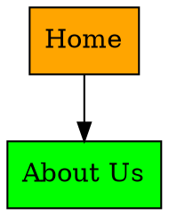

# Website Audit Tools - API Documentation

**Base URL:** `http://localhost:3000`  
**Version:** 2.0.0  
**Last Updated:** April 16, 2026

## What's New in v2.0.0

- 🤖 **AI Chat**: New conversational AI endpoint to ask questions about any audit report (powered by DeepSeek)
- 🔑 **Keyword Consistency**: Per-page keyword frequency analysis — individual keywords + 2-word phrases with presence in title, meta description, and headings
- 📊 **Heading Frequency**: Structured H1–H6 frequency breakdowns with actual heading text values per page
- 🏪 **Local Business Schema Rule**: Validates LocalBusiness JSON-LD schema — required fields, opening hours, aggregate rating, geo coordinates
- 📍 **Google Business Profile Rule**: Detects GBP links in HTML and schema `sameAs`; flags missing GBP for local businesses
- 🧩 **44 Total SEO Rules**: 2 new structured-data rules added (LocalBusinessSchema, GoogleBusinessProfile)
- ⚠️ **Recommendations temporarily disabled**: The recommendations endpoints are inactive pending reimplementation

## What's New in v1.3.0

- 🔗 **Link Graph Visualization**: New endpoint to generate internal linking structure as force-directed graph data
- 📊 **Graph Analytics**: Automatic identification of orphan pages, hub pages, and authority pages
- 🎨 **Multiple Export Formats**: JSON, DOT (Graphviz), and CSV formats for link graph data
- 📈 **Site Structure Insights**: BFS depth calculation, inbound/outbound link counts, and detailed metrics

## What's New in v1.2.0

- ✨ **Passing Checks**: Reports now show both issues AND what's working well!
- 📸 **Screenshot Endpoint**: On-demand desktop & mobile screenshots (base64) via separate API call

## What's New in v1.1.0

- ✅ **9 New SEO Checks**: Keyword consistency, heading structure, word count, link analysis, mobile viewport, robots.txt, sitemap, favicon, HTTP/2
- ✅ **34 Total Rules**: Expanded from 25 to 34 comprehensive SEO checks

---

## Table of Contents

1. [Authentication](#authentication)
2. [Audit Queue Endpoints](#audit-queue-endpoints)
3. [Audit Report Endpoints](#audit-report-endpoints)
4. [Issues Endpoints](#issues-endpoints)
5. [Recommendations Endpoints](#recommendations-endpoints) ⚠️ *Temporarily disabled*
6. [Pages Endpoints](#pages-endpoints)
7. [User Management Endpoints](#user-management-endpoints)
8. [Statistics & Analytics Endpoints](#statistics--analytics-endpoints)
9. [Screenshot Endpoints](#screenshot-endpoints)
10. [Link Graph Endpoints](#link-graph-endpoints)
11. [AI Chat Endpoints](#ai-chat-endpoints)
12. [Health Check](#health-check)
13. [Error Handling](#error-handling)
14. [Data Models](#data-models)

---

## Authentication

Currently, the API does not require authentication for development. In production, integrate with Clerk for JWT-based authentication.

**User Tiers:**
- `FREE`: Limited audits per month
- `PAID`: Unlimited audits

---

## Audit Queue Endpoints

### 1. Create Audit Job

Queues a new SEO audit job for asynchronous processing.

**Endpoint:** `POST /api/audits`

**Request Body:**
```json
{
  "url": "https://example.com",
  "userId": "clxxx123456",           // Optional - uses dev user if omitted
  "mode": "single",                  // "single" or "multi"
  "pageLimit": 10,                   // Required for multi mode (default: 10)
  "forceRecrawl": false              // Optional - bypass cache (default: false)
}
```

**Request Parameters:**
| Parameter | Type | Required | Default | Description |
|-----------|------|----------|---------|-------------|
| url | string | Yes | - | Website URL to audit |
| userId | string | No | dev user | User ID from database |
| mode | string | No | "single" | "single" for one page, "multi" for full site |
| pageLimit | number | No | 10 | Max pages to crawl (multi mode only) |
| forceRecrawl | boolean | No | false | Skip cache, force fresh crawl |

**Success Response (201 Created):**
```json
{
  "jobId": "1234567890",
  "message": "Audit job queued successfully",
  "url": "https://example.com",
  "mode": "single",
  "forceRecrawl": false
}
```

**Error Responses:**
```json
// 400 Bad Request - Missing URL
{
  "error": "URL is required"
}

// 400 Bad Request - Invalid mode
{
  "error": "Mode must be \"single\" or \"multi\""
}

// 400 Bad Request - No user found
{
  "error": "No userId provided and test user not found. Run: npx prisma db seed"
}

// 500 Internal Server Error
{
  "error": "Failed to queue audit job",
  "details": "Connection timeout"
}
```

---

### 2. Check Job Status

Poll this endpoint to monitor audit progress.

**Endpoint:** `GET /api/audits/jobs/:jobId`

**URL Parameters:**
| Parameter | Type | Description |
|-----------|------|-------------|
| jobId | string | BullMQ job ID from create audit response |

**Success Response (200 OK):**
```json
{
  "id": "1234567890",
  "state": "completed",               // waiting, active, completed, failed
  "progress": 100,                    // 0-100
  "data": {
    "url": "https://example.com",
    "userId": "clxxx123456",
    "mode": "single",
    "pageLimit": null,
    "options": {
      "forceRecrawl": false
    }
  },
  "returnvalue": {
    "success": true,
    "auditReportId": "clyyy789012",
    "overallScore": 78.5,
    "issuesFound": 23,
    "pagesAnalyzed": 1
  },
  "failedReason": null
}
```

**Progress Stages:**
- `0-20%`: Crawling/Loading pages
- `20-60%`: Analyzing SEO rules
- `60-80%`: Generating recommendations
- `80-100%`: Saving to database

**Job States:**
| State | Description |
|-------|-------------|
| waiting | Job is queued |
| active | Currently processing |
| completed | Successfully finished |
| failed | Error occurred (see failedReason) |

**Error Responses:**
```json
// 404 Not Found
{
  "error": "Job not found"
}

// 500 Internal Server Error
{
  "error": "Failed to get job status",
  "details": "Redis connection error"
}
```

---

## Audit Report Endpoints

### 3. Get All Audit Reports

Retrieve a paginated list of all audit reports.

**Endpoint:** `GET /api/reports`

**Query Parameters:**
| Parameter | Type | Default | Description |
|-----------|------|---------|-------------|
| page | number | 1 | Page number (1-indexed) |
| limit | number | 10 | Results per page |
| status | string | - | Filter by: PROCESSING, COMPLETED, FAILED |
| userId | string | - | Filter by user ID |

**Example Request:**
```
GET /api/reports?page=1&limit=20&status=COMPLETED&userId=clxxx123456
```

**Success Response (200 OK):**
```json
{
  "data": [
    {
      "id": "clyyy789012",
      "jobId": "1234567890",
      "url": "https://example.com",
      "mode": "SINGLE",
      "pageLimit": null,
      "pagesAnalyzed": 1,
      "overallScore": 78.5,
      "technicalScore": 85.0,
      "onPageScore": 72.0,
      "performanceScore": 68.0,
      "accessibilityScore": 90.0,
      "linkScore": 75.0,
      "structuredDataScore": 50.0,
      "securityScore": 100.0,
      "status": "COMPLETED",
      "errorMessage": null,
      "userId": "clxxx123456",
      "createdAt": "2026-03-26T10:30:00.000Z",
      "completedAt": "2026-03-26T10:32:15.000Z",
      "_count": {
        "issues": 23,
        "recommendations": 8,
        "pages": 1
      }
    }
  ],
  "pagination": {
    "page": 1,
    "limit": 20,
    "total": 45,
    "totalPages": 3
  }
}
```

---

### 4. Get Specific Audit Report

Retrieve a complete audit report with all related data.

**Endpoint:** `GET /api/reports/:id`

**URL Parameters:**
| Parameter | Type | Description |
|-----------|------|-------------|
| id | string | Audit report ID |

**Success Response (200 OK):**
```json
{
  "id": "clyyy789012",
  "jobId": "1234567890",
  "url": "https://example.com",
  "mode": "SINGLE",
  "pageLimit": null,
  "pagesAnalyzed": 1,
  "overallScore": 78.5,
  "technicalScore": 85.0,
  "onPageScore": 72.0,
  "performanceScore": 68.0,
  "accessibilityScore": 90.0,
  "linkScore": 75.0,
  "structuredDataScore": 50.0,
  "securityScore": 100.0,
  "status": "COMPLETED",
  "errorMessage": null,
  "userId": "clxxx123456",
  "passingChecks": [
    {
      "category": "SECURITY",
      "code": "NO_HTTPS",
      "title": "HTTPS Enabled",
      "description": "Site is using HTTPS for security and SEO benefits",
      "pageUrl": "https://example.com",
      "goodPractice": "HTTPS protects user data and is a ranking factor"
    },
    {
      "category": "ON_PAGE",
      "code": "TITLE_MISSING",
      "title": "Title Tag Present",
      "description": "Page has a proper title tag that helps search engines and users understand the content",
      "pageUrl": "https://example.com",
      "goodPractice": "Title tags are essential for SEO and improve click-through rates"
    }
  ],
  "createdAt": "2026-03-26T10:30:00.000Z",
  "completedAt": "2026-03-26T10:32:15.000Z",
  "user": {
    "id": "clxxx123456",
    "email": "user@example.com",
    "tier": "PAID"
  },
  "pages": [
    {
      "id": "clzzz456789",
      "url": "https://example.com",
      "title": "Example Domain - Best Practices",
      "description": "This domain is for use in illustrative examples",
      "statusCode": 200,
      "loadTime": 850.5,
      "lcp": 1200.0,
      "fid": null,
      "cls": 0.05,
      "wordCount": 450,
      "imageCount": 5,
      "linkCount": 12,
      "h1Count": 1,
      "headingsData": [
        { "level": 1, "text": "Welcome to Example" },
        { "level": 2, "text": "Features" },
        { "level": 2, "text": "About Us" }
      ],
      "imagesData": [
        { "src": "/logo.png", "alt": "Company Logo" },
        { "src": "/hero.jpg", "alt": null }
      ],
      "linksData": [
        { "href": "/about", "text": "About", "isInternal": true },
        { "href": "https://external.com", "text": "Partner", "isInternal": false }
      ],
      "canonical": "https://example.com/",
      "robots": "index, follow",
      "ogImage": "https://example.com/og-image.jpg",
      "hasSchemaOrg": true,
      "localSeoData": {
        "phone": { "found": true, "number": "+1-555-0123", "source": "footer" },
        "address": { "found": true, "text": "123 Main St, City", "source": "contact page" }
      },
      "crawledAt": "2026-03-26T10:30:45.000Z",
      "auditReportId": "clyyy789012",
      "createdAt": "2026-03-26T10:32:10.000Z"
    }
  ],
  "issues": [
    {
      "id": "cliii123456",
      "category": "ACCESSIBILITY",
      "type": "missing_alt_text",
      "title": "Images Missing Alt Text",
      "description": "1 image(s) found without alt text, which hurts accessibility and SEO",
      "severity": "MEDIUM",
      "impactScore": 15.0,
      "pageUrl": "https://example.com",
      "elementSelector": "img[src='/hero.jpg']",
      "lineNumber": null,
      "auditReportId": "clyyy789012",
      "pageId": "clzzz456789",
      "createdAt": "2026-03-26T10:32:12.000Z"
    },
    {
      "id": "cliii123457",
      "category": "ON_PAGE",
      "type": "keyword_consistency_poor",
      "title": "Keywords Not Distributed Well",
      "description": "Your page's main keywords (cloudflare, security, network) appear frequently in content but not in title, meta description, or heading tags.",
      "severity": "LOW",
      "impactScore": 45.0,
      "pageUrl": "https://example.com",
      "elementSelector": "{\"keywords\":[{\"keyword\":\"cloudflare\",\"frequency\":32,\"inTitle\":false,\"inMeta\":false,\"inHeadings\":true}]}",
      "lineNumber": null,
      "auditReportId": "clyyy789012",
      "pageId": "clzzz456789",
      "createdAt": "2026-03-26T10:32:12.000Z"
    },
    {
      "id": "cliii123458",
      "category": "TECHNICAL",
      "type": "missing_viewport",
      "title": "Missing Mobile Viewport Tag",
      "description": "Your page does not specify a viewport meta tag. This causes poor rendering on mobile devices and hurts mobile SEO.",
      "severity": "HIGH",
      "impactScore": 85.0,
      "pageUrl": "https://example.com",
      "elementSelector": null,
      "lineNumber": null,
      "auditReportId": "clyyy789012",
      "pageId": "clzzz456789",
      "createdAt": "2026-03-26T10:32:12.000Z"
    },
    {
      "id": "cliii123459",
      "category": "LINKS",
      "type": "link_structure_analysis",
      "title": "Link Structure Analysis",
      "description": "Found 287 total links: 234 internal, 53 external (follow), 0 external (nofollow). 18% are external links.",
      "severity": "LOW",
      "impactScore": 0,
      "pageUrl": "https://example.com",
      "elementSelector": "{\"total\":287,\"internal\":234,\"externalFollow\":53,\"externalNofollow\":0,\"externalPercentage\":18}",
      "lineNumber": null,
      "auditReportId": "clyyy789012",
      "pageId": "clzzz456789",
      "createdAt": "2026-03-26T10:32:12.000Z"
    }
  ],
  "recommendations": [
    {
      "id": "clrrr789012",
      "title": "Add Alt Text to Images",
      "description": "Adding descriptive alt text to images improves accessibility for screen readers and helps search engines understand image content.",
      "priority": 3,
      "estimatedTimeMinutes": 15,
      "difficulty": "BEGINNER",
      "category": "ACCESSIBILITY",
      "fixGuideId": null,
      "auditReportId": "clyyy789012",
      "issueId": "cliii123456",
      "createdAt": "2026-03-26T10:32:13.000Z",
      "steps": [
        {
          "id": "clsss123456",
          "stepNumber": 1,
          "instruction": "Locate the image in your HTML file",
          "codeExample": "",
          "toolsNeeded": ["Text editor", "Browser DevTools"],
          "recommendationId": "clrrr789012"
        },
        {
          "id": "clsss123457",
          "stepNumber": 2,
          "instruction": "Add a descriptive alt attribute that explains what the image shows",
          "codeExample": "",
          "toolsNeeded": ["Text editor"],
          "recommendationId": "clrrr789012"
        }
      ]
    }
  ]
}
```

**Error Responses:**
```json
// 404 Not Found
{
  "error": "Audit report not found"
}

// 500 Internal Server Error
{
  "error": "Failed to fetch audit report",
  "details": "Database connection error"
}
```

---

### 5. Get User's Audit Reports

Retrieve all audit reports for a specific user.

**Endpoint:** `GET /api/users/:userId/reports`

**URL Parameters:**
| Parameter | Type | Description |
|-----------|------|-------------|
| userId | string | User ID |

**Query Parameters:**
| Parameter | Type | Default | Description |
|-----------|------|---------|-------------|
| page | number | 1 | Page number |
| limit | number | 10 | Results per page |

**Example Request:**
```
GET /api/users/clxxx123456/reports?page=1&limit=5
```

**Success Response (200 OK):**
```json
{
  "data": [
    {
      "id": "clyyy789012",
      "jobId": "1234567890",
      "url": "https://example.com",
      "mode": "SINGLE",
      "pagesAnalyzed": 1,
      "overallScore": 78.5,
      "status": "COMPLETED",
      "createdAt": "2026-03-26T10:30:00.000Z",
      "_count": {
        "issues": 23,
        "recommendations": 8,
        "pages": 1
      }
    }
  ],
  "pagination": {
    "page": 1,
    "limit": 5,
    "total": 12,
    "totalPages": 3
  }
}
```

---

### 6. Delete Audit Report

Delete an audit report and all associated data (cascading delete).

**Endpoint:** `DELETE /api/reports/:id`

**URL Parameters:**
| Parameter | Type | Description |
|-----------|------|-------------|
| id | string | Audit report ID |

**Success Response (200 OK):**
```json
{
  "message": "Audit report deleted successfully"
}
```

**Error Responses:**
```json
// 404 Not Found
{
  "error": "Audit report not found"
}

// 500 Internal Server Error
{
  "error": "Failed to delete audit report",
  "details": "Foreign key constraint violation"
}
```

---

## Issues Endpoints

### 7. Get All Issues for Report

Retrieve all SEO issues found in an audit report.

**Endpoint:** `GET /api/repo

**New Issue Types (v1.1.0):**
- `keyword_consistency_poor` / `keyword_consistency_good` - Keyword distribution analysis
- `heading_structure_good` / `heading_structure_limited` / `heading_structure_missing` - H1-H6 usage
- `word_count_good` / `word_count_moderate` - Content length assessment
- `link_structure_analysis` - Internal/external link ratios
- `too_many_external_links` - High external link percentage
- `unfriendly_urls` - Non-human-readable URLs
- `missing_viewport` / `viewport_correct` / `viewport_misconfigured` - Mobile viewport
- `robots_txt_found` / `robots_txt_missing` / `blocked_by_robots` - Robots.txt detection
- `sitemap_found` / `sitemap_unknown` - XML sitemap detection
- `favicon_present` / `favicon_missing` - Favicon check
- `http2_likely` / `http2_impossible` - HTTP/2 protocol check

**Special Data in elementSelector:**
For analysis-type issues, `elementSelector` contains JSON data:
- **Keyword Analysis**: `{"keywords": [{"keyword": "example", "frequency": 10, "inTitle": true, "inMeta": false, "inHeadings": true}]}`
- **Heading Structure**: `{"h1": 1, "h2": 8, "h3": 6, "h4": 3, "h5": 7, "h6": 36}`
- **Link Analysis**: `{"total": 287, "internal": 234, "externalFollow": 53, "externalNofollow": 0, "externalPercentage": 18}`rts/:reportId/issues`

**URL Parameters:**
| Parameter | Type | Description |
|-----------|------|-------------|
| reportId | string | Audit report ID |

**Query Parameters:**
| Parameter | Type | Description |
|-----------|------|-------------|
| severity | string | Filter by: CRITICAL, HIGH, MEDIUM, LOW |
| category | string | Filter by: TECHNICAL, ON_PAGE, PERFORMANCE, ACCESSIBILITY, LINKS, STRUCTURED_DATA, SECURITY |

**Example Request:**
```
GET /api/reports/clyyy789012/issues?severity=CRITICAL&category=TECHNICAL
```

**Success Response (200 OK):**
```json
[
  {
    "id": "cliii123456",
    "category": "TECHNICAL",
    "type": "page_non_200_status",
    "title": "Page Returns Non-200 Status Code",
    "description": "This page returns a 404 status code, making it invisible to search engines",
    "severity": "CRITICAL",
    "impactScore": 95.0,
    "pageUrl": "https://example.com/broken-page",
    "elementSelector": null,
    "lineNumber": null,
    "auditReportId": "clyyy789012",
    "pageId": "clzzz456790",
    "createdAt": "2026-03-26T10:32:12.000Z",
    "page": {
      "url": "https://example.com/broken-page",
      "title": null
    }
  }
]
```

**Issues Sorted By:**
1. Severity (CRITICAL → LOW)
2. Impact Score (High → Low)

---

### 8. Get Issues by Category

Retrieve all issues in a specific category.

**Endpoint:** `GET /api/reports/:reportId/issues/category/:category`

**URL Parameters:**
| Parameter | Type | Description |
|-----------|------|-------------|
| reportId | string | Audit report ID |
| category | string | TECHNICAL, ON_PAGE, PERFORMANCE, ACCESSIBILITY, LINKS, STRUCTURED_DATA, SECURITY |

**Example Request:**
```
GET /api/reports/clyyy789012/issues/category/ACCESSIBILITY
```

**Success Response (200 OK):**
```json
[
  {
    "id": "cliii123456",
    "category": "ACCESSIBILITY",
    "type": "missing_alt_text",
    "title": "Images Missing Alt Text",
    "description": "3 image(s) found without alt text",
    "severity": "MEDIUM",
    "impactScore": 15.0,
    "pageUrl": "https://example.com",
    "elementSelector": "img[alt='']",
    "auditReportId": "clyyy789012",
    "pageId": "clzzz456789",
    "createdAt": "2026-03-26T10:32:12.000Z"
  }
]
```

---

## Recommendations Endpoints

> ⚠️ **Temporarily Disabled**: The recommendations endpoints are currently inactive while the recommendations engine is being reimplemented. Endpoints `GET /api/reports/:reportId/recommendations` and `GET /api/recommendations/:id` return 404.

---

## Pages Endpoints

### 11. Get All Pages for Report

Retrieve all pages analyzed in an audit.

**Endpoint:** `GET /api/reports/:reportId/pages`

**URL Parameters:**
| Parameter | Type | Description |
|-----------|------|-------------|
| reportId | string | Audit report ID |

**Success Response (200 OK):**
```json
[
  {
    "id": "clzzz456789",
    "url": "https://example.com",
    "title": "Example Domain",
    "description": "This domain is for examples",
    "statusCode": 200,
    "loadTime": 850.5,
    "lcp": 1200.0,
    "fid": null,
    "cls": 0.05,
    "wordCount": 450,
    "imageCount": 5,
    "linkCount": 12,
    "h1Count": 1,
    "headingsData": [...],
    "imagesData": [...],
    "linksData": [...],
    "canonical": "https://example.com/",
    "robots": "index, follow",
    "ogImage": "https://example.com/og-image.jpg",
    "hasSchemaOrg": true,
    "localSeoData": {...},
    "crawledAt": "2026-03-26T10:30:45.000Z",
    "auditReportId": "clyyy789012",
    "createdAt": "2026-03-26T10:32:10.000Z",
    "_count": {
      "issues": 8
    }
  },
  {
    "id": "clzzz456790",
    "url": "https://example.com/about",
    "title": "About Us - Example",
    "statusCode": 200,
    "loadTime": 720.0,
    "_count": {
      "issues": 3
    }
  }
]
```

**Pages Sorted By:** URL (alphabetically)

---

### 12. Get Specific Page

Retrieve a single page with all cached crawl data and issues.

**Endpoint:** `GET /api/pages/:id`

**URL Parameters:**
| Parameter | Type | Description |
|-----------|------|-------------|
| id | string | Page ID |

**Success Response (200 OK):**
```json
{
  "id": "clzzz456789",
  "url": "https://example.com",
  "title": "Example Domain - Best Practices",
  "description": "This domain is for use in illustrative examples in documents",
  "statusCode": 200,
  "loadTime": 850.5,
  "lcp": 1200.0,
  "fid": null,
  "cls": 0.05,
  "wordCount": 450,
  "imageCount": 5,
  "linkCount": 12,
  "h1Count": 1,
  "headingsData": [
    { "level": 1, "text": "Welcome to Example" },
    { "level": 2, "text": "Features" },
    { "level": 2, "text": "About Us" },
    { "level": 3, "text": "Our Mission" }
  ],
  "imagesData": [
    { "src": "/logo.png", "alt": "Company Logo" },
    { "src": "/hero.jpg", "alt": null },
    { "src": "/team.jpg", "alt": "Our team at work" }
  ],
  "linksData": [
    { "href": "/about", "text": "About", "isInternal": true },
    { "href": "/contact", "text": "Contact", "isInternal": true },
    { "href": "https://external.com", "text": "Partner", "isInternal": false }
  ],
  "canonical": "https://example.com/",
  "robots": "index, follow",
  "ogImage": "https://example.com/og-image.jpg",
  "hasSchemaOrg": true,
  "localSeoData": {
    "phone": {
      "found": true,
      "number": "+1-555-0123",
      "source": "footer"
    },
    "address": {
      "found": true,
      "text": "123 Main Street, Example City, ST 12345",
      "source": "contact page"
    }
  },
  "crawledAt": "2026-03-26T10:30:45.000Z",
  "auditReportId": "clyyy789012",
  "createdAt": "2026-03-26T10:32:10.000Z",
  "issues": [
    {
      "id": "cliii123456",
      "category": "ACCESSIBILITY",
      "type": "missing_alt_text",
      "title": "Images Missing Alt Text",
      "description": "1 image(s) found without alt text",
      "severity": "MEDIUM",
      "impactScore": 15.0,
      "pageUrl": "https://example.com",
      "elementSelector": "img[src='/hero.jpg']",
      "auditReportId": "clyyy789012",
      "pageId": "clzzz456789",
      "createdAt": "2026-03-26T10:32:12.000Z"
    }
  ]
}
```

**Error Responses:**
```json
// 404 Not Found
{
  "error": "Page not found"
}
```

---

## User Management Endpoints

### 13. Get All Users

Retrieve all registered users.

**Endpoint:** `GET /api/users`

**Success Response (200 OK):**
```json
[
  {
    "id": "clxxx123456",
    "email": "user@example.com",
    "clerkId": "user_2abcdef123456",
    "tier": "PAID",
    "auditsUsedThisMonth": 8,
    "lastResetDate": "2026-03-01T00:00:00.000Z",
    "createdAt": "2026-01-15T08:23:00.000Z",
    "_count": {
      "auditReports": 28
    }
  },
  {
    "id": "clxxx123457",
    "email": "free@example.com",
    "clerkId": "user_2xyz789012",
    "tier": "FREE",
    "auditsUsedThisMonth": 3,
    "lastResetDate": "2026-03-01T00:00:00.000Z",
    "createdAt": "2026-02-10T14:45:00.000Z",
    "_count": {
      "auditReports": 5
    }
  }
]
```

---

### 14. Get Specific User

Retrieve a single user's information.

**Endpoint:** `GET /api/users/:id`

**URL Parameters:**
| Parameter | Type | Description |
|-----------|------|-------------|
| id | string | User ID |

**Success Response (200 OK):**
```json
{
  "id": "clxxx123456",
  "email": "user@example.com",
  "clerkId": "user_2abcdef123456",
  "tier": "PAID",
  "auditsUsedThisMonth": 8,
  "lastResetDate": "2026-03-01T00:00:00.000Z",
  "createdAt": "2026-01-15T08:23:00.000Z",
  "updatedAt": "2026-03-26T10:30:00.000Z",
  "_count": {
    "auditReports": 28
  }
}
```

**Error Responses:**
```json
// 404 Not Found
{
  "error": "User not found"
}
```

---

### 15. Create User

Create a new user account.

**Endpoint:** `POST /api/users`

**Request Body:**
```json
{
  "email": "newuser@example.com",
  "clerkId": "user_2newclerkid",
  "tier": "FREE"                    // Optional, defaults to "FREE"
}
```

**Success Response (201 Created):**
```json
{
  "id": "clxxx123458",
  "email": "newuser@example.com",
  "clerkId": "user_2newclerkid",
  "tier": "FREE",
  "auditsUsedThisMonth": 0,
  "lastResetDate": "2026-03-26T10:35:00.000Z",
  "createdAt": "2026-03-26T10:35:00.000Z",
  "updatedAt": "2026-03-26T10:35:00.000Z"
}
```

**Error Responses:**
```json
// 400 Bad Request
{
  "error": "Email and clerkId are required"
}

// 500 Internal Server Error - Duplicate email
{
  "error": "Failed to create user",
  "details": "Unique constraint failed on email"
}
```

---

### 16. Update User

Update user tier or audit usage.

**Endpoint:** `PATCH /api/users/:id`

**URL Parameters:**
| Parameter | Type | Description |
|-----------|------|-------------|
| id | string | User ID |

**Request Body:**
```json
{
  "tier": "PAID",               // Optional: "FREE" or "PAID"
  "auditsUsedThisMonth": 0      // Optional: Reset usage counter
}
```

**Success Response (200 OK):**
```json
{
  "id": "clxxx123456",
  "email": "user@example.com",
  "clerkId": "user_2abcdef123456",
  "tier": "PAID",
  "auditsUsedThisMonth": 0,
  "lastResetDate": "2026-03-01T00:00:00.000Z",
  "createdAt": "2026-01-15T08:23:00.000Z",
  "updatedAt": "2026-03-26T10:40:00.000Z"
}
```

---

### 17. Delete User

Delete a user account (cascades to all audit reports).

**Endpoint:** `DELETE /api/users/:id`

**URL Parameters:**
| Parameter | Type | Description |
|-----------|------|-------------|
| id | string | User ID |

**Success Response (200 OK):**
```json
{
  "message": "User deleted successfully"
}
```

**Error Responses:**
```json
// 500 Internal Server Error
{
  "error": "Failed to delete user",
  "details": "User not found"
}
```

---

## Screenshot Endpoints

### 21. Capture Website Screenshots

Capture desktop and mobile screenshots of a website on-demand.

**Endpoint:** `POST /api/screenshots`

**Request Body:**
```json
{
  "url": "https://example.com"
}
```

**Request Parameters:**
| Parameter | Type | Required | Description |
|-----------|------|----------|-------------|
| url | string | Yes | Website URL to capture |

**Success Response (200 OK):**
```json
{
  "url": "https://example.com",
  "screenshots": {
    "desktop": "/9j/4AAQSkZJRgABAQEAYABgAAD/2wBD...(base64 encoded JPEG)",
    "mobile": "/9j/4AAQSkZJRgABAQEAYABgAAD/2wBD...(base64 encoded JPEG)"
  },
  "timestamp": "2026-04-06T10:30:00.000Z"
}
```

**Screenshot Specifications:**

**Desktop View:**
- Viewport: 1920x1080 (16:9)
- Format: JPEG (85% quality)
- Capture: Viewport only (no scrolling)
- User Agent: Randomized Chrome Desktop
- Anti-bot: ✅ Full stealth mode enabled

**Mobile View:**
- Viewport: 375x667 (iPhone 6/7/8)
- Format: JPEG (85% quality)
- Capture: Viewport only (no overflow)
- User Agent: Mobile Safari
- Touch: Enabled
- Anti-bot: ✅ Full stealth mode enabled

**Performance:**
- Duration: 3-5 seconds (parallel capture)
- Timeout: 20 seconds max
- Memory: ~1-3MB per screenshot

**Anti-Bot Protection:**
- Randomized user agents and headers
- Anti-detection script injection
- Timezone and locale randomization
- Realistic browser fingerprinting
- Bypasses most bot detection systems

**Use Cases:**
- Lazy load screenshots when user clicks "View Screenshots"
- Export visual audit reports
- Before/after comparisons
- Mobile vs desktop layout verification

**Frontend Example:**
```javascript
async function loadScreenshots(url) {
  const response = await fetch('http://localhost:3000/api/screenshots', {
    method: 'POST',
    headers: { 'Content-Type': 'application/json' },
    body: JSON.stringify({ url })
  });
  
  const data = await response.json();
  
  // Display images
  desktopImg.src = `data:image/jpeg;base64,${data.screenshots.desktop}`;
  mobileImg.src = `data:image/jpeg;base64,${data.screenshots.mobile}`;
}
```

**Error Responses:**
```json
// 400 Bad Request - Missing URL
{
  "error": "URL is required"
}

// 400 Bad Request - Invalid URL
{
  "error": "Invalid URL format"
}

// 500 Internal Server Error
{
  "error": "Failed to capture screenshots",
  "details": "Navigation timeout exceeded"
}
```

**Important Notes:**
- Screenshots are NOT stored in database
- Each request captures fresh screenshots
- Does not bypass Cloudflare/advanced bot detection
- Limited to publicly accessible URLs
- Consider caching on frontend to reduce API calls

---

## Link Graph Endpoints

### 22. Get Internal Link Graph

Retrieve the internal linking structure of a crawled website as a force-directed graph data structure.

**Endpoint:** `GET /api/reports/:reportId/link-graph`

**URL Parameters:**
| Parameter | Type | Required | Description |
|-----------|------|----------|-------------|
| reportId | string | Yes | The ID of the completed audit report |

**Query Parameters:**
| Parameter | Type | Required | Default | Description |
|-----------|------|----------|---------|-------------|
| maxDepth | number | No | - | Filter nodes by maximum depth from homepage (e.g., `3`) |
| format | string | No | json | Export format: `json`, `dot` (Graphviz), or `csv` |

**Success Response (200 OK - JSON format):**
```json
{
  "nodes": [
    {
      "id": "https://example.com/",
      "label": "Home - Example Website",
      "url": "https://example.com/",
      "type": "page",
      "title": "Home - Example Website",
      "inboundCount": 0,
      "outboundCount": 15,
      "depth": 0,
      "statusCode": 200,
      "loadTime": 1250,
      "wordCount": 850,
      "hasIssues": false,
      "isOrphan": false,
      "isHub": true,
      "isAuthority": false
    },
    {
      "id": "https://example.com/about",
      "label": "About Us",
      "url": "https://example.com/about",
      "type": "page",
      "title": "About Us",
      "inboundCount": 8,
      "outboundCount": 5,
      "depth": 1,
      "statusCode": 200,
      "loadTime": 980,
      "wordCount": 1200,
      "hasIssues": false,
      "isOrphan": false,
      "isHub": false,
      "isAuthority": true
    }
  ],
  "edges": [
    {
      "id": "edge-0",
      "source": "https://example.com/",
      "target": "https://example.com/about",
      "anchorText": "Learn more about us",
      "strength": 1
    }
  ],
  "metadata": {
    "totalPages": 45,
    "totalLinks": 178,
    "maxDepth": 4,
    "orphanPages": 3,
    "hubPages": 2,
    "authorityPages": 5,
    "averageLinksPerPage": 3.9,
    "generatedAt": "2026-04-06T12:34:56.789Z"
  }
}
```

**Node Properties:**

| Property | Type | Description |
|----------|------|-------------|
| id | string | Unique identifier (URL) |
| label | string | Display label (page title or path) |
| url | string | Full URL of the page |
| type | string | Always "page" |
| title | string \| null | Page title from HTML |
| inboundCount | number | Number of pages linking to this page |
| outboundCount | number | Number of links going out from this page |
| depth | number | Distance from homepage (BFS depth) |
| statusCode | number | HTTP status code |
| loadTime | number | Page load time in milliseconds |
| wordCount | number | Total word count on page |
| hasIssues | boolean | Whether page has SEO issues |
| isOrphan | boolean | No inbound links (orphan page) |
| isHub | boolean | High outbound count (>10 links) |
| isAuthority | boolean | High inbound count (>5 links) |

**Edge Properties:**

| Property | Type | Description |
|----------|------|-------------|
| id | string | Unique edge identifier |
| source | string | Source URL |
| target | string | Target URL |
| anchorText | string \| undefined | Link anchor text (if available) |
| strength | number | Edge weight (1 by default) |

**Example Requests:**

```bash
# Get full link graph (JSON format)
curl http://localhost:3000/api/reports/cmn7kr6dw002gbcm982rcqau3/link-graph

# Get link graph limited to 3 levels deep
curl http://localhost:3000/api/reports/cmn7kr6dw002gbcm982rcqau3/link-graph?maxDepth=3

# Export as DOT format (Graphviz)
curl "http://localhost:3000/api/reports/cmn7kr6dw002gbcm982rcqau3/link-graph?format=dot" > graph.dot

# Export as CSV
curl "http://localhost:3000/api/reports/cmn7kr6dw002gbcm982rcqau3/link-graph?format=csv"
```

**DOT Format Response:**


**CSV Format Response:**
```json
{
  "nodes": "URL,Title,Inbound Links,Outbound Links,Depth,Status Code,Load Time,Word Count,Is Orphan,Is Hub,Is Authority\n\"https://example.com/\",\"Home\",0,15,0,200,1250,850,false,true,false\n...",
  "edges": "Source URL,Target URL,Anchor Text\n\"https://example.com/\",\"https://example.com/about\",\"Learn more\"\n..."
}
```

**Error Responses:**
```json
// 404 Not Found - Report doesn't exist
{
  "error": "Audit report not found"
}

// 400 Bad Request - Report not completed
{
  "error": "Audit report is not completed yet",
  "status": "PROCESSING"
}

// 500 Internal Server Error
{
  "error": "Failed to generate link graph",
  "details": "Invalid page data format"
}
```

**Use Cases:**
- **Visualize site structure**: Create interactive force-directed graphs with D3.js
- **Identify orphan pages**: Find pages with no inbound links (SEO issue)
- **Find authority pages**: Discover most-linked-to pages (high value content)
- **Analyze link depth**: Understand how deep pages are in the site hierarchy
- **Export for analysis**: Use DOT format for Graphviz or CSV for spreadsheets

**Frontend Visualization:**

See the complete implementation guide in [`LINK_GRAPH_VISUALIZATION.md`](./LINK_GRAPH_VISUALIZATION.md) for:
- Full D3.js force-directed graph example
- Interactive controls (zoom, pan, filter)
- Color-coded nodes (orphans, hubs, authorities)
- Tooltips with detailed metrics
- Export to SVG/PNG
- React integration example

**Quick D3.js Example:**
```javascript
// Fetch graph data
const response = await fetch(`/api/reports/${reportId}/link-graph`);
const graph = await response.json();

// Create force simulation
const simulation = d3.forceSimulation(graph.nodes)
  .force('link', d3.forceLink(graph.edges).id(d => d.id))
  .force('charge', d3.forceManyBody().strength(-300))
  .force('center', d3.forceCenter(width / 2, height / 2));

// Render nodes and edges
const links = svg.selectAll('line')
  .data(graph.edges)
  .join('line');

const nodes = svg.selectAll('circle')
  .data(graph.nodes)
  .join('circle')
  .attr('r', d => 5 + d.inboundCount * 2)
  .attr('fill', d => d.isOrphan ? 'red' : 'blue');

simulation.on('tick', () => {
  links
    .attr('x1', d => d.source.x)
    .attr('y1', d => d.source.y)
    .attr('x2', d => d.target.x)
    .attr('y2', d => d.target.y);
  
  nodes
    .attr('cx', d => d.x)
    .attr('cy', d => d.y);
});
```

**Performance Notes:**
- Graph generation typically takes 100-500ms for sites with <100 pages
- For large sites (>500 pages), use `maxDepth` parameter to limit nodes
- Consider caching graph data on frontend for 5-10 minutes
- DOT export is useful for server-side rendering with Graphviz

**Important Notes:**
- Only available for COMPLETED audit reports
- Multi-page crawls (`mode: "multi"`) produce more useful graphs
- Single-page audits will have minimal graph structure
- Orphan pages indicate potential SEO issues (not linked from anywhere)
- Hub pages (>10 outbound links) may indicate navigation/menu pages
- Authority pages (>5 inbound links) often represent important content

---

## AI Chat Endpoints

### 25. Chat About an Audit Report

Ask AI-powered questions about any completed audit report. Uses DeepSeek LLM with conversation memory and supports streaming via Server-Sent Events.

**Endpoint:** `POST /api/reports/:reportId/chat`

**URL Parameters:**
| Parameter | Type | Required | Description |
|-----------|------|----------|-------------|
| reportId | string | Yes | The audit report ID |

**Request Body:**
| Field | Type | Required | Description |
|-------|------|----------|-------------|
| message | string | Yes | Question or message about the audit |
| userId | string | Yes | User ID |
| conversationId | string | No | Continue an existing conversation |
| stream | boolean | No | Stream response via SSE (default: `true`) |

**Streaming Response (SSE — `text/event-stream`):**

Each line is a newline-delimited JSON event:
```
data: {"type":"chunk","content":"Based on your audit..."}\n\n
data: {"type":"chunk","content":" the main issues are..."}\n\n
data: {"type":"done","conversationId":"conv_abc123","suggestedQuestions":["What should I fix first?","How do I improve page speed?"]}\n\n
```

**Non-Streaming Response (200 OK — when `stream: false`):**
```json
{
  "content": "Based on your audit, the main issues are...",
  "conversationId": "conv_abc123",
  "suggestedQuestions": [
    "What should I fix first?",
    "How do I improve my page speed?",
    "Which issues affect rankings the most?"
  ]
}
```

**Error Response (404):**
```json
{
  "error": "Report not found or not completed yet"
}
```

---

### 26. Get Suggested Questions

Get AI-generated suggested questions for an audit report.

**Endpoint:** `GET /api/reports/:reportId/chat/suggestions`

**Success Response (200 OK):**
```json
{
  "reportId": "clyyy789012",
  "suggestedQuestions": [
    "What are the most critical issues to fix?",
    "How can I improve my page speed?",
    "What's causing the low SEO score?"
  ]
}
```

---

### 27. Get Conversation Metadata

Retrieve metadata about an existing chat conversation.

**Endpoint:** `GET /api/conversations/:conversationId`

**Success Response (200 OK):**
```json
{
  "conversationId": "conv_abc123",
  "reportId": "clyyy789012",
  "userId": "clxxx123456",
  "messageCount": 5,
  "createdAt": "2026-04-16T10:30:00.000Z",
  "updatedAt": "2026-04-16T10:45:00.000Z"
}
```

---

### 28. Get Conversation Stats

Get statistics about a conversation (message count, token usage, etc.).

**Endpoint:** `GET /api/conversations/:conversationId/stats`

---

### 29. Delete Conversation

Delete a conversation and its message history.

**Endpoint:** `DELETE /api/conversations/:conversationId`

**Success Response (200 OK):**
```json
{
  "message": "Conversation deleted successfully"
}
```

---

### 30. List User Conversations

List all conversations for a given user.

**Endpoint:** `GET /api/users/:userId/conversations`

**Success Response (200 OK):**
```json
[
  {
    "conversationId": "conv_abc123",
    "reportId": "clyyy789012",
    "messageCount": 5,
    "updatedAt": "2026-04-16T10:45:00.000Z"
  }
]
```

---

## Statistics & Analytics Endpoints

### 23. Get Overall Statistics

Retrieve system-wide statistics and analytics.

**Endpoint:** `GET /api/stats`

**Success Response (200 OK):**
```json
{
  "reports": {
    "total": 150,
    "completed": 142,
    "failed": 3,
    "processing": 5
  },
  "issues": {
    "total": 3456,
    "byCategory": [
      {
        "category": "ON_PAGE",
        "_count": 1200
      },
      {
        "category": "ACCESSIBILITY",
        "_count": 850
      },
      {
        "category": "TECHNICAL",
        "_count": 650
      },
      {
        "category": "PERFORMANCE",
        "_count": 450
      },
      {
        "category": "LINKS",
        "_count": 200
      },
      {
        "category": "SECURITY",
        "_count": 106
      }
    ],
    "bySeverity": [
      {
        "severity": "CRITICAL",
        "_count": 45
      },
      {
        "severity": "HIGH",
        "_count": 520
      },
      {
        "severity": "MEDIUM",
        "_count": 1890
      },
      {
        "severity": "LOW",
        "_count": 1001
      }
    ]
  },
  "users": {
    "total": 42
  },
  "cache": {
    "totalCrawls": 200,
    "cacheHits": 165,
    "cacheMisses": 35,
    "hitRate": 82.5,
    "averageLoadTimeSaved": 2500
  }
}
```

---

### 24. Get Report Statistics by Date Range

Retrieve audit reports within a date range.

**Endpoint:** `GET /api/stats/reports`

**Query Parameters:**
| Parameter | Type | Default | Description |
|-----------|------|---------|-------------|
| startDate | string (ISO) | 30 days ago | Start date (YYYY-MM-DD) |
| endDate | string (ISO) | today | End date (YYYY-MM-DD) |

**Example Request:**
```
GET /api/stats/reports?startDate=2026-03-01&endDate=2026-03-26
```

**Success Response (200 OK):**
```json
[
  {
    "createdAt": "2026-03-26T10:30:00.000Z",
    "status": "COMPLETED",
    "overallScore": 78.5
  },
  {
    "createdAt": "2026-03-25T14:20:00.000Z",
    "status": "COMPLETED",
    "overallScore": 85.2
  },
  {
    "createdAt": "2026-03-25T09:15:00.000Z",
    "status": "FAILED",
    "overallScore": 0
  }
]
```

---

## Health Check

### 31. API Health Check

Verify API is running and get endpoint information.

**Endpoint:** `GET /`

**Success Response (200 OK):**
```json
{
  "message": "Website Audit Tools API",
  "version": "2.0.0",
  "endpoints": {
    "audits": "/api/audits",
    "reports": "/api/reports",
    "users": "/api/users",
    "stats": "/api/stats",
    "screenshots": "/api/screenshots",
    "chat": "/api/reports/:reportId/chat",
    "linkGraph": "/api/reports/:reportId/link-graph"
  }
}
```

**Analysis Issue Types Note:**

Some issues with severity "LOW" and `impactScore` of 0 are informational/analysis results rather than problems:
- **Good indicators**: `keyword_consistency_good`, `heading_structure_good`, `word_count_good`, `viewport_correct`, `robots_txt_found`, `sitemap_found`, `favicon_present`, `http2_likely`
- **Action needed**: All issues with `impactScore > 0` require fixes

---

## Error Handling

All endpoints follow consistent error response patterns.

### Common HTTP Status Codes

| Code | Meaning | When Used |
|------|---------|-----------|
| 200 | OK | Successful GET/PATCH/DELETE |
| 201 | Created | Successful POST |
| 400 | Bad Request | Missing required fields, invalid parameters |
| 404 | Not Found | Resource doesn't exist |
| 500 | Internal Server Error | Database errors, unexpected failures |

### Error Response Format

```json
{
  "error": "Human-readable error message",
  "details": "Technical details or stack trace (optional)"
}
```

### Common Errors

**Database Connection Failed:**
```json
{
  "error": "Failed to fetch audit reports",
  "details": "Connection timeout - database unreachable"
}
```

**Invalid Request:**
```json
{
  "error": "URL is required"
}
```

**Resource Not Found:**
```json
{
  "error": "Audit report not found"
}
```

---

## Data Models

### Passing Checks (New in v1.2.0)

**PassingCheck Interface:**
```typescript
{
  category: string;        // IssueCategory (TECHNICAL, ON_PAGE, etc.)
  code: string;           // Rule code that passed (e.g., "TITLE_MISSING")
  title: string;          // Human-readable name
  description: string;    // What was checked
  pageUrl?: string;       // Which page passed
  goodPractice: string;   // Explanation of why this is good
}
```

---

### Heading Frequency (New in v2.0.0)

**HeadingFrequency Interface:**
```typescript
{
  level: number;     // Heading level (1–6)
  tag: string;       // HTML tag name ("h1", "h2", etc.)
  count: number;     // Number of headings at this level on the page
  values: string[];  // Actual heading text values
}
```

**PageHeadingSummary Interface:**
```typescript
{
  pageUrl: string;
  frequency: HeadingFrequency[];  // One entry per heading level found
}
```

**Example:**
```json
{
  "pageUrl": "https://example.com/about",
  "frequency": [
    { "level": 1, "tag": "h1", "count": 1, "values": ["About Us"] },
    { "level": 2, "tag": "h2", "count": 3, "values": ["Our Mission", "Our Team", "Our History"] },
    { "level": 3, "tag": "h3", "count": 5, "values": ["John Doe", "Jane Smith", "..."] }
  ]
}
```

---

### Keyword Consistency (New in v2.0.0)

**KeywordEntry Interface:**
```typescript
{
  keyword: string;            // Individual word or 2-word phrase
  inTitle: boolean;           // Present in page title
  inMetaDescription: boolean; // Present in meta description
  inHeadingTags: boolean;     // Present in any heading (H1–H6)
  pageFrequency: number;      // Occurrence count in page body
}
```

**PageKeywordConsistency Interface:**
```typescript
{
  pageUrl: string;
  passed: boolean;                // Whether keyword consistency is good
  message: string;                // Summary message
  keywords: KeywordEntry[];       // Top individual keywords
  phrases: KeywordEntry[];        // Top 2-word phrases
}
```

**Example:**
```json
{
  "pageUrl": "https://example.com/",
  "passed": true,
  "message": "Keywords are consistent across page elements",
  "keywords": [
    {
      "keyword": "seo",
      "inTitle": true,
      "inMetaDescription": true,
      "inHeadingTags": true,
      "pageFrequency": 12
    }
  ],
  "phrases": [
    {
      "keyword": "website audit",
      "inTitle": false,
      "inMetaDescription": true,
      "inHeadingTags": true,
      "pageFrequency": 4
    }
  ]
}
```

---

**Example Passing Checks:**
- "HTTPS Enabled" - Site uses SSL/TLS encryption
- "Title Tag Present" - Page has proper title tag
- "Meta Description Present" - Meta description exists
- "H1 Heading Present" - Page has exactly one H1
- "Viewport Configured" - Mobile viewport meta tag is set
- "Fast Load Time" - Page loads in under 3 seconds
- "All Images Have Alt Text" - Accessibility compliance

**Benefits:**
- Shows complete SEO health picture
- Positive reinforcement for users
- Educational value (explains WHY things are good)
- Progress tracking over time
- Encourages best practices

**Typical Report Breakdown:**
- 17 issues found (things to fix)
- 27 passing checks (things working well)
- Total: 44 rules checked
- Overall Score: 82/100

### Score Ranges

All scores are 0-100:
- **90-100**: Excellent
- **75-89**: Good
- **50-74**: Needs Improvement
- **0-49**: Poor

### Enum Values

**AuditMode:**
- `SINGLE`: Audit one page only
- `MULTI`: Crawl multiple pages (up to pageLimit)

**AuditStatus:**
- `PROCESSING`: Job is currently running
- `COMPLETED`: Audit finished successfully
- `FAILED`: Audit encountered an error

**UserTier:**
- `FREE`: Limited monthly audits
- `PAID`: Unlimited audits

**IssueCategory:**
- `TECHNICAL`: Crawlability, indexability, canonicals
- `ON_PAGE`: Meta tags, headings, content
- `PERFORMANCE`: Load speed, Core Web Vitals
- `ACCESSIBILITY`: Alt text, ARIA, contrast
- `LINKS`: Broken links, internal linking
- `STRUCTURED_DATA`: Schema.org, Open Graph
- `SECURITY`: HTTPS, security headers

**Severity:**
- `CRITICAL`: Fix immediately - prevents indexing
- `HIGH`: Important - significantly impacts rankings
- `MEDIUM`: Should fix - moderate impact
- `LOW`: Nice to have - minimal impact
### SEO Rule Coverage

As of v2.0.0, the system includes **44 comprehensive SEO rules**:

**Technical (11):**
- HTTPSCheck, SSLEnabled, CanonicalTag, NoindexTag, NoindexHeader, RobotsTxtBlocking, XMLSitemap, Charset, MissingRobots, HTTP2, JavaScriptErrors

**On-Page (11):**
- TitleTag (40–60 chars), MetaDescription, H1Tag, HeadingHierarchy, KeywordConsistency, WordCount, ImageAltText, Hreflang, LangAttribute, SERPSnippet, FriendlyURL

**Performance (11):**
- CoreWebVitals, LoadTime, FlashUsage, PageSize, ResourceCount, ImageOptimization, Minification, PageSpeedMobile, PageSpeedDesktop, Compression, AMP

**Links (1):**
- LinkStructure

**Usability (8):**
- IFrameUsage, EmailPrivacy, DeprecatedTags, InlineStyles, MobileViewport, Favicon, FontSize, TapTargetSize

**Social (10):**
- FacebookLink, FacebookPixel, TwitterLink, InstagramLink, LinkedInLink, YouTubeLink, YouTubeActivity, LocalSEO, OpenGraphTags, TwitterCardTags

**Structured Data (3):**
- IdentitySchema, LocalBusinessSchema, GoogleBusinessProfile

**Coverage:** ~90% parity with SEOptimizer's free report (excluding backlinks and keyword rankings which require external APIs)


**Difficulty:**
- `BEGINNER`: Anyone can implement
- `INTERMEDIATE`: Requires basic technical knowledge
- `ADVANCED`: Requires developer skills

---

## Usage Examples

### Complete Workflow Example

```bash
# 1. Create an audit job
curl -X POST http://localhost:3000/api/audits \
  -H "Content-Type: application/json" \
  -d '{
    "url": "https://example.com",
    "mode": "multi",
    "pageLimit": 20
  }'

# Response: { "jobId": "1234567890", ... }

# 2. Check job progress (poll every 5 seconds)
curl http://localhost:3000/api/audits/jobs/1234567890

# Response: { "state": "active", "progress": 45, ... }

# 3. Once completed, get the report
curl http://localhost:3000/api/audits/jobs/1234567890

# Response: { "state": "completed", "returnvalue": { "auditReportId": "clyyy789012", ... } }

# 4. Retrieve full audit report
curl http://localhost:3000/api/reports/clyyy789012

# 5. Get specific issues by severity
curl http://localhost:3000/api/reports/clyyy789012/issues?severity=CRITICAL

# 6. Chat about the audit (AI-powered)
curl -X POST http://localhost:3000/api/reports/clyyy789012/chat \
  -H "Content-Type: application/json" \
  -d '{"message": "What should I fix first?", "userId": "clxxx123456", "stream": false}'
```

### JavaScript/Fetch Example

```javascript
// Create audit and wait for completion
async function runAudit(url) {
  // Step 1: Queue the audit
  const createResponse = await fetch('http://localhost:3000/api/audits', {
    method: 'POST',
    headers: { 'Content-Type': 'application/json' },
    body: JSON.stringify({
      url: url,
      mode: 'single',
      forceRecrawl: false
    })
  });
  
  const { jobId } = await createResponse.json();
  console.log(`Job queued: ${jobId}`);
  
  // Step 2: Poll for completion
  let completed = false;
  let auditReportId;
  
  while (!completed) {
    await new Promise(resolve => setTimeout(resolve, 3000)); // Wait 3 seconds
    
    const statusResponse = await fetch(`http://localhost:3000/api/audits/jobs/${jobId}`);
    const status = await statusResponse.json();
    
    console.log(`Progress: ${status.progress}% - State: ${status.state}`);
    
    if (status.state === 'completed') {
      completed = true;
      auditReportId = status.returnvalue.auditReportId;
    } else if (status.state === 'failed') {
      throw new Error(`Audit failed: ${status.failedReason}`);
    }
  }
  
  // Step 3: Fetch full report
  const reportResponse = await fetch(`http://localhost:3000/api/reports/${auditReportId}`);
  const report = await reportResponse.json();
  
  console.log(`Overall Score: ${report.overallScore}/100`);
  console.log(`Issues Found: ${report.issues.length}`);
  console.log(`Passing Checks: ${report.passingChecks.length}`);
}
```

**Analysis Results Notes:**
- All 44 rules run on every audit
- Analysis issues (impactScore = 0) provide insights, not problems
- Data-rich issues include JSON in `elementSelector` field
- Parse JSON to display keyword tables, heading breakdowns, link stats

---

## Support & Documentation

For more information, see:
- [PROJECT_WORKFLOW.md](./PROJECT_WORKFLOW.md) - System architecture
- [prisma/schema.prisma](./prisma/schema.prisma) - Complete database schema
- [src/services/analyzer/rules/](./src/services/analyzer/rules/) - All SEO rules
- [SEOPTIMER_COMPARISON.md](./SEOPTIMER_COMPARISON.md) - Feature comparison with SEOptimizer
- [CLOUDFLARE_BYPASS_GUIDE.md](./CLOUDFLARE_BYPASS_GUIDE.md) - Bot detection bypass strategies

**API Version:** 2.0.0  
**Last Updated:** April 16, 2026  
**Total SEO Rules:** 44 (all rules check for both passing and failing conditions)

## New Features Detail

### Passing Checks Feature

Every audit now returns both:
- **Issues** (`issues[]`): What needs to be fixed
- **Passing Checks** (`passingChecks[]`): What's already working well

**Example Response:**
```json
{
  "overallScore": 82,
  "totalIssues": 17,
  "totalPasses": 27,
  "issues": [...],
  "passingChecks": [
    {
      "category": "SECURITY",
      "code": "NO_HTTPS",
      "title": "HTTPS Enabled",
      "description": "Site is using HTTPS for security and SEO benefits",
      "goodPractice": "HTTPS protects user data and is a ranking factor"
    }
  ]
}
```

### Screenshot Endpoint

Separate on-demand endpoint for visual previews:
- Desktop screenshot (1920x1080)
- Mobile screenshot (375x667)
- Base64 JPEG format
- 2-4 second response time
- Not stored in database
- Perfect for lazy loading in UI

## Rate Limits & Best Practices

**Polling Frequency:**
- Poll job status every 3-5 seconds
- Don't poll more frequently than every 1 second

**Concurrent Audits:**
- System processes 5 concurrent jobs
- Additional jobs are queued automatically

**Caching:**
- Pages are cached for 24 hours by default
- Use `forceRecrawl: true` to bypass cache
- Cache improves performance by 80%+

**Page Limits:**
- Single mode: Always 1 page
- Multi mode: Default 10, max recommended 100
- Large sites (>100 pages) may take 5-10 minutes

**URL Format:**
- Always include protocol: `https://example.com` (not `example.com`)
- System normalizes trailing slashes automatically

---

## Support & Documentation

For more information, see:
- [PROJECT_WORKFLOW.md](./PROJECT_WORKFLOW.md) - System architecture
- [prisma/schema.prisma](./prisma/schema.prisma) - Complete database schema
- [src/services/analyzer/rules/](./src/services/analyzer/rules/) - All SEO rules

**API Version:** 2.0.0  
**Last Updated:** April 16, 2026
